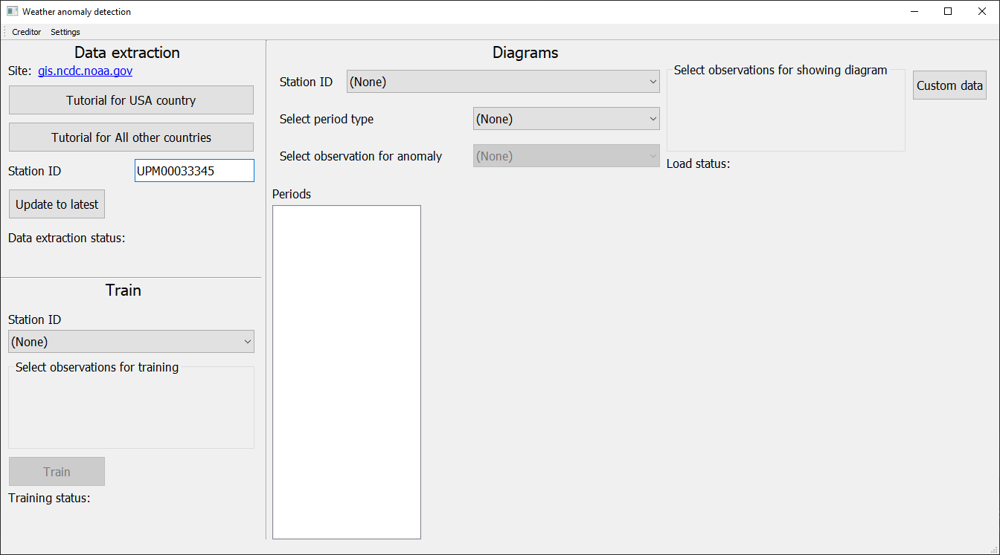
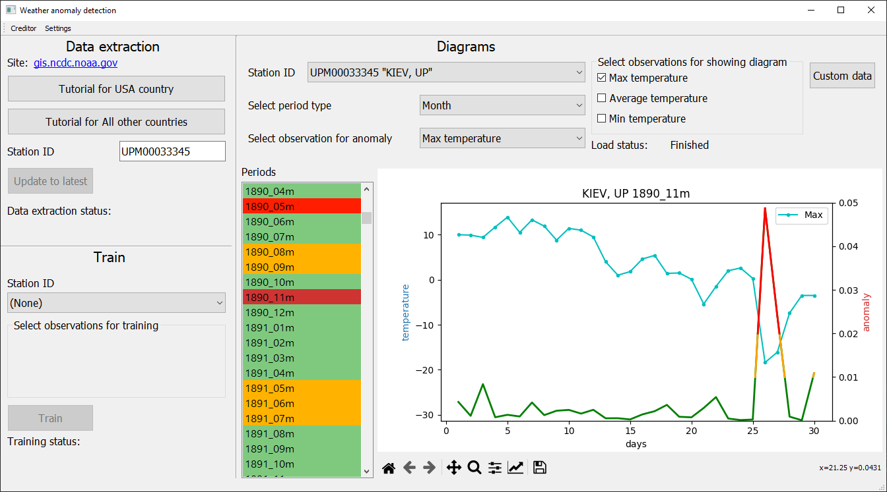

# Weather-anomaly-detection
###Internship 2020
__Task:__ Detecting anomalies in meteorological data using autoencoder.

__Solution__: The program, which is training on data from [National Centers for Environmental Information](https://gis.ncdc.noaa.gov/maps/ncei/cdo/daily) and predict anomaly values for some region. 

## List of libraries to install
``` 
pip install %library_name%
```
- tensorflow
- keras
- PyQt5*
- pygame* 
- matplotlib
- numpy

_\* - maybe you need to install it on system_

###Program screenshots



